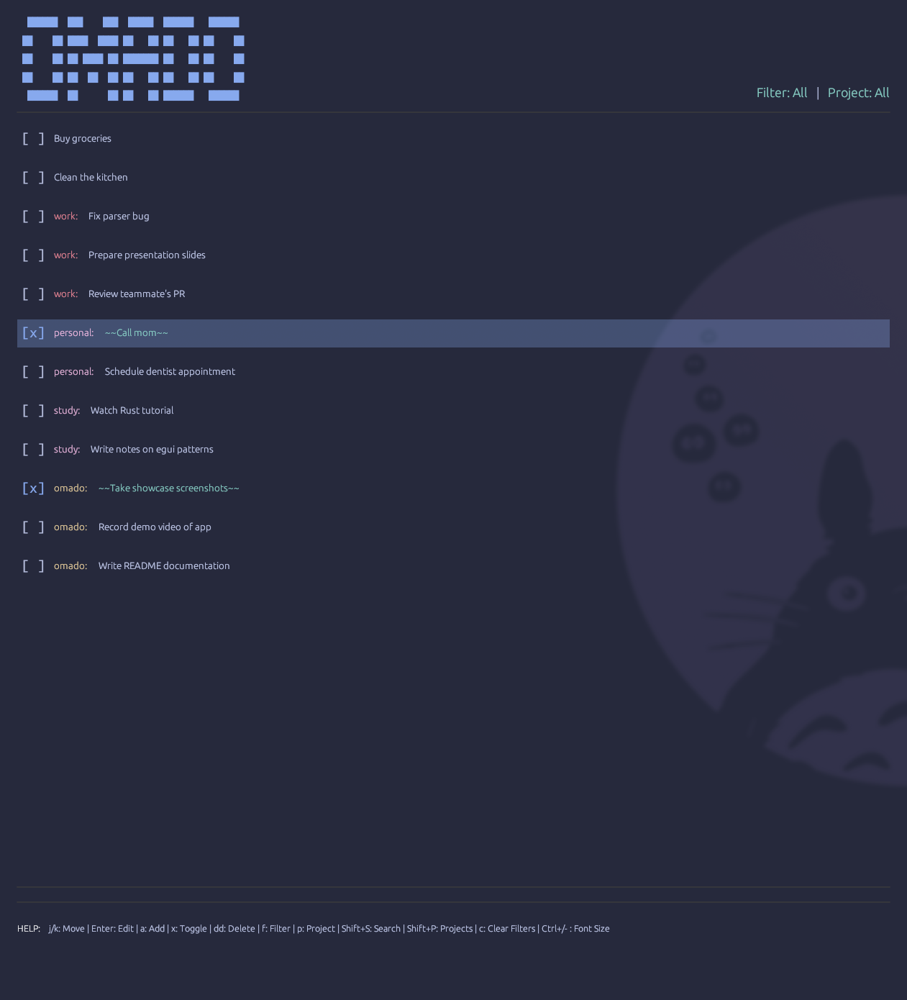
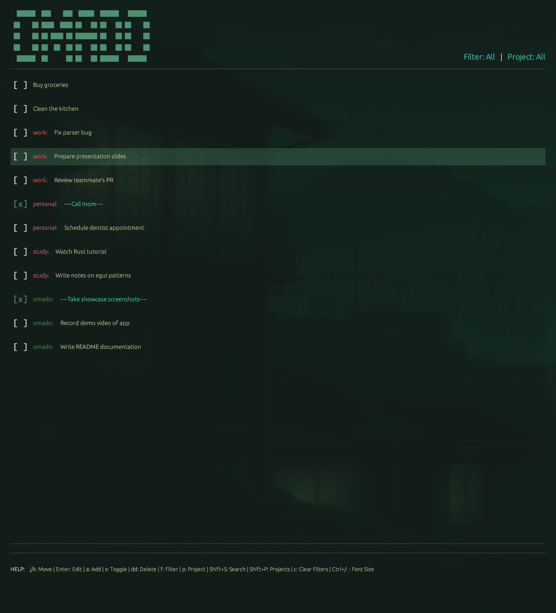
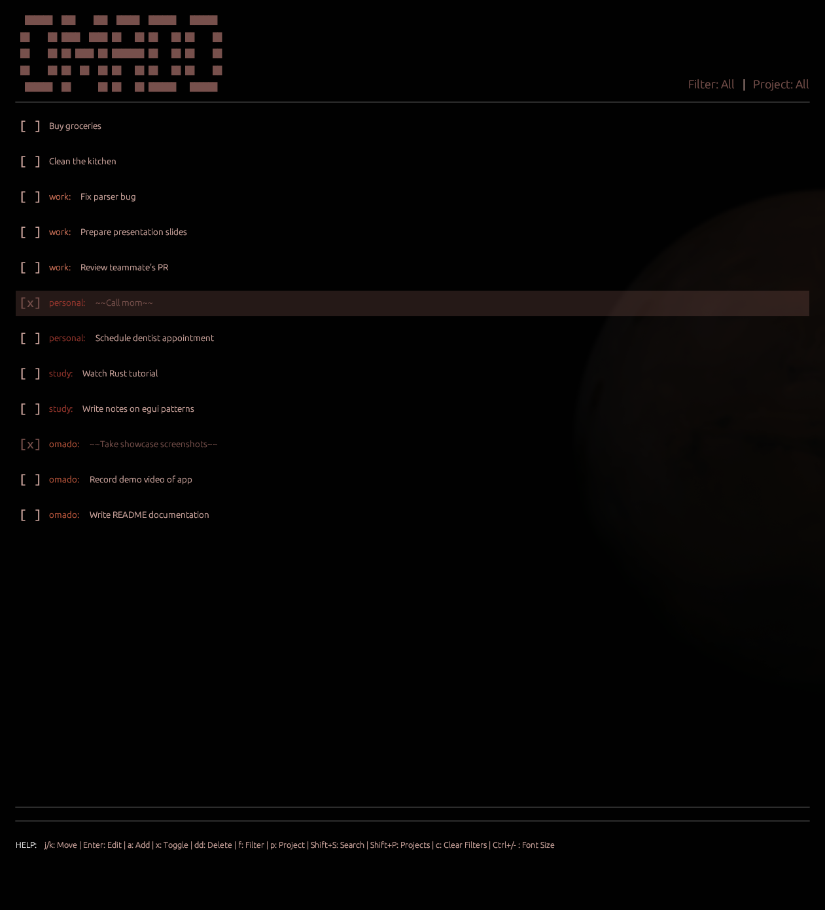
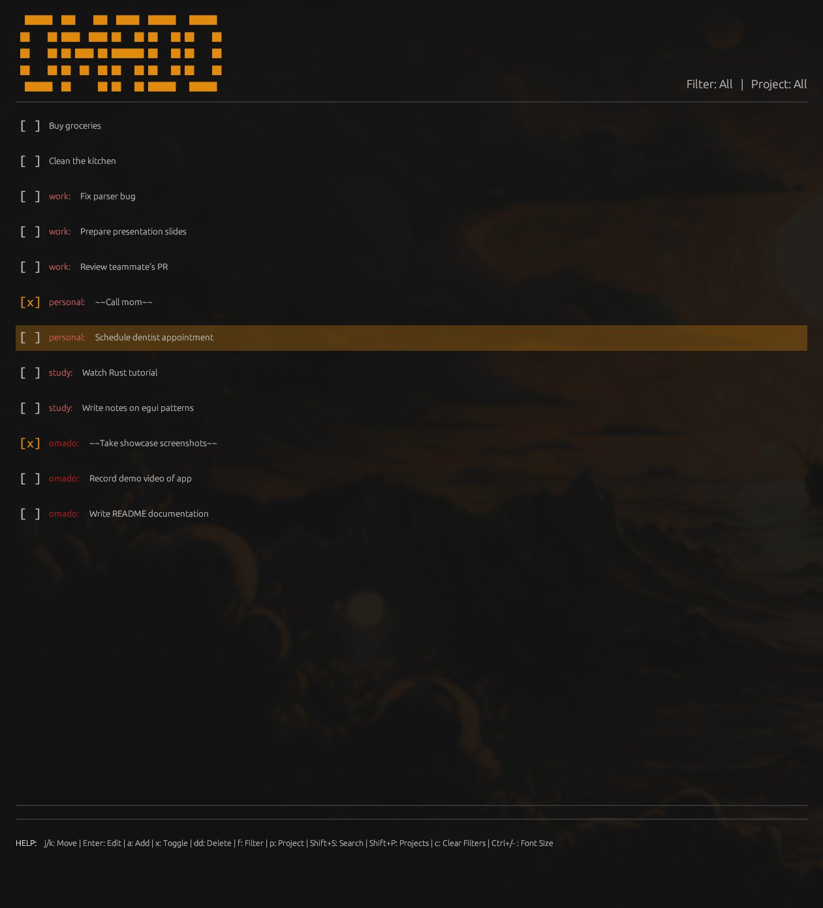

# omado 

A fast, minimal todo application built specifically for Omarchy. Both GUI and CLI interfaces. Built with Rust and egui, featuring project organization, theme integration, and a clean aesthetic.

<table>
  <tr>
    <td></td>
    <td></td>
  </tr>
  <tr>
    <td></td>
    <td></td>
  </tr>
</table>


## Features

- **Dual Interface**: Both GUI and command-line interfaces
- **Project Organization**: Group tasks with `project:` prefixes
- **Theme Integration**: Automatically syncs with Alacritty terminal themes
- **Keyboard-Driven**: Vim-inspired navigation (j/k, dd, etc.)
- **Fast & Lightweight**: Native Rust performance
- **Linux-Native**: Built specifically for Linux and Omarchy

## Installation


### Option 1: Build Manually

```bash
# Clone and build
git clone https://github.com/ejuro/omado
cd omado
cargo build --release

# The binary will be at target/release/omado
# Copy it to a directory in your PATH, e.g.:
sudo cp target/release/omado /usr/local/bin/


```

### Requirements

- **Linux only** (built for Omarchy)
- Rust 1.70+ (install from [rustup.rs](https://rustup.rs/))
- Development packages: `libxcb`, `libxrandr`, `libxi`

### Hyprland Setup

When switching away from the workspace where OmaDo is open, Hyprland may show an "Application not responding" popup after a few seconds.

#### Why this happens

- Hyprland throttles or pauses windows that are off-screen
- If an app isn't receiving frame updates, the compositor thinks it's frozen
- OmaDo still works fine when you return — it's just a false alarm

#### How to fix it

1. Add to the bottom section of `~/.config/hypr/hyprland.conf` if it is not already there:
```
source = ~/.config/hypr/windows.conf
```

2. Create `~/.config/hypr/windows.conf` if it does not already exist, with:
```
# Keep omado lightly rendering in the background to avoid ANR popups
windowrulev2 = renderunfocused, title:^omado$
```

## Usage

### GUI Mode (Default)

Launch the GUI application:

```bash
omado
```

#### GUI Keyboard Shortcuts

| Key | Action |
|-----|--------|
| `j` / `↓` | Move down |
| `k` / `↑` | Move up |
| `a` | Add new task |
| `Enter` | Edit selected task |
| `x` | Toggle task completion |
| `dd` | Delete task (press twice) |
| `f` | Cycle filter (All → Active → Done) |
| `p` | Cycle project filter |
| `c` | Clear all filters |
| `Shift+S` | Toggle search |
| `Shift+P` | Open project palette |
| `Escape` | Cancel/Clear |
| `g` / `Shift+G` | Go to top/bottom |

### CLI Mode

Add tasks from the command line:

```bash
# Add a simple task
omado add "Buy groceries"

# Add a task with a project
omado add "work: Fix parser bug"
omado add "personal: Call mom"

# Get help
omado help
```

### Project Organization

Tasks can be organized into projects using the `project:` syntax:

- `work: Fix the login bug` - Assigned to "work" project
- `personal: Book dentist appointment` - Assigned to "personal" project
- `Buy milk` - No project assigned

#### Project Features

- **Color-coded**: Each project gets a unique theme-based color
- **Filtering**: Press `p` to cycle through projects or `Shift+P` for project palette
- **Statistics**: View task counts per project in the palette

### File Storage

Tasks are stored in a plain text file at:

- **Linux**: `~/.local/share/omado/todo.txt` (respects `$XDG_DATA_HOME`)

The format is compatible with standard todo.txt syntax:

```
[ ] Buy groceries
[x] work: Fix parser bug
[ ] personal: Call mom
```

### Theme Integration

omado automatically syncs with your Alacritty terminal theme by reading:

- **Main config**: `~/.config/alacritty/alacritty.toml`
- **Imported themes**: Supports Alacritty's `import` feature

Colors update automatically when you change your terminal theme (with a short delay).


### Dependencies

- [egui](https://github.com/emilk/egui) - Immediate mode GUI
- [eframe](https://github.com/emilk/egui/tree/master/crates/eframe) - GUI framework
- [serde](https://serde.rs/) - Serialization
- [toml](https://github.com/toml-rs/toml) - TOML parsing for themes
- [shellexpand](https://github.com/netvl/shellexpand) - Shell path expansion
- [anyhow](https://github.com/dtolnay/anyhow) - Error handling
- [libc](https://github.com/rust-lang/libc) - Low-level system calls for process forking


## License

This project is licensed under the MIT License - see the [LICENSE](LICENSE) file for details.

## Changelog

### v0.1.0 (Initial Release)

- GUI and CLI interfaces
- Project organization with `project:` syntax
- Alacritty theme integration
- Keyboard-driven navigation
- Real-time theme updates
